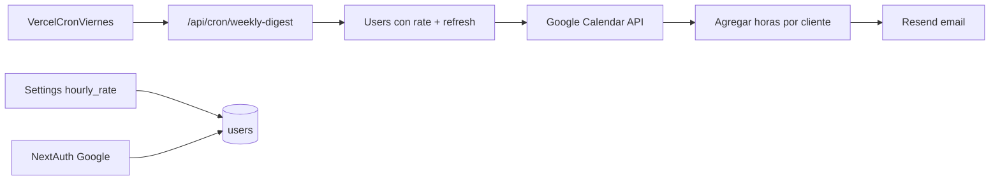

# Digest semanal Resend + precio/hora

## Decisiones fijadas

- **Semana:** lunes → viernes inclusive (timezone `Europe/Madrid`, ya usada en el proyecto).
- **Precio:** un `hourly_rate` global en **EUR**.
- **“Proyecto”:** cliente parseado del título del evento (`extractClientFromSummary`), igual que hoy en Welcome.
- **Mes:** month-to-date hasta el viernes inclusive.
- **Envío:** a cada usuario con Google conectado + `hourly_rate` configurado.

## Contexto actual

- Horas desde Google Calendar vía [`app/api/calendar/events/route.ts`](app/api/calendar/events/route.ts); no hay timesheets en DB.
- Email stub en [`shared/services/email.ts`](shared/services/email.ts) (falla en prod).
- Settings solo auth en [`features/settings/ui/layouts/SettingsLayout`](features/settings/ui/layouts/SettingsLayout/index.tsx).
- Tokens Google solo en JWT de NextAuth — **bloqueante para cron**; hay que persistir refresh token.

## 1. Base de datos

Añadir columnas en `users` (migración SQL + funciones en [`database/auth/users.ts`](database/auth/users.ts)):

- `hourly_rate` `NUMERIC(10,2) NULL`
- `google_refresh_token` `TEXT NULL`
- `google_access_token` `TEXT NULL` (opcional cache)
- `google_token_expires_at` `TIMESTAMPTZ NULL`

Al login Google en [`app/api/auth/[...nextauth]/route.ts`](app/api/auth/[...nextauth]/route.ts): guardar `refresh_token` / `access_token` (pedir `access_type: "offline"` + `prompt: "consent"` en el provider para obtener refresh).

## 2. Settings: precio/hora

- API `GET/PATCH` [`app/api/settings/hourly-rate/route.ts`](app/api/settings/hourly-rate/route.ts) con `SETTINGS_READ` / `SETTINGS_UPDATE`.
- Hook `useHourlyRate` + form en nueva tab **Facturación** en Settings (InputNumber EUR).
- Respuesta `{ data: { hourlyRate } }`.

## 3. Resend

- Dependencia `resend`.
- Env: `RESEND_API_KEY`, `EMAIL_FROM`, `CRON_SECRET`.
- Extender [`shared/services/email.ts`](shared/services/email.ts):
  - Implementar verificación con Resend (reemplaza el throw en prod).
  - Nueva `sendWeeklyDigestEmail(...)` con HTML: resumen semana (horas + €), resumen mes MTD (horas + €), tabla Proyecto | Horas | Importe (€), totales.

## 4. Cálculo del digest (server)

Reutilizar/extraer de [`shared/utils/googleCalendarEvents.ts`](shared/utils/googleCalendarEvents.ts) y [`shared/utils/dates.ts`](shared/utils/dates.ts):

- `getCurrentWeekMonFriRange(now)` → `timeMin` lun 00:00, `timeMax` sáb 00:00 (exclusivo).
- MTD: reutilizar lógica de `getDateRangeFromMonthKey` con `timeMax` = sábado 00:00 del viernes.
- Fetch eventos con access token (refresh si expiró).
- Agregar por cliente; eventos sin cliente → fila `"Sin proyecto"`.
- `earnings = hours * hourlyRate`.

## 5. Cron viernes

- Ruta [`app/api/cron/weekly-digest/route.ts`](app/api/cron/weekly-digest/route.ts) protegida con header `Authorization: Bearer CRON_SECRET`.
- [`vercel.json`](vercel.json): cron `0 17 * * 5` (viernes 17:00 UTC ≈ 18:00 Madrid invierno / 19:00 verano; fijo y predecible).
- Por usuario: skip si falta rate o refresh token; log errores sin tumbar el batch.
- Endpoint opcional de prueba manual con el mismo secret (mismo handler).

## 6. Archivos nuevos (requieren tu OK al ejecutar)

Solo con tu autorización al implementar:

- migración SQL
- `app/api/settings/hourly-rate/route.ts`
- `app/api/cron/weekly-digest/route.ts`
- hook + componente settings
- `vercel.json`
- utils de agregación / refresh Google si no caben limpios en archivos existentes

## Orden de implementación

1. Migración + persistencia tokens Google
2. API + UI precio/hora
3. Resend (verificación + digest)
4. Lógica agregación + cron
5. Probar con llamada manual al cron y un envío real de prueba
